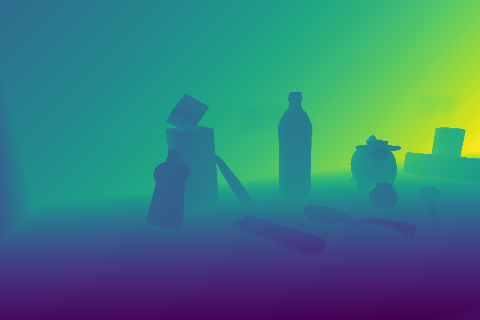
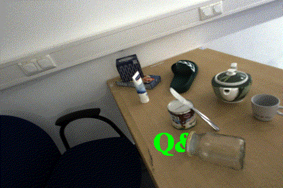

# Polarimetric Depth Estimation
***

## Introduction

<div style="text-align: center">
  
</div>

Welcome to the repository of our project on Polarimetric Depth Estimation!

We present a supervised monocular depth prediction model leveraging polarimetric characteristics of light.
During the model development, particular emphasis was put on improvement of the depth estimation for photometrically challenging objects.

For details about the project, architecture design and ablation studies, have a look at our
[final presentation](docs/PolarimetricDepthEstimation_FinalPresentation.pdf).

For description of the branches, check the corresponding section.


## Dataset

For training and tests we used the [HAMMER](https://arxiv.org/abs/2205.04565) dataset.


## Installation

In order to run the code, dependencies need to be installed first.
This can be done by creating a conda environment using the `environment.yml` provided in the repository root.

Open a terminal in the root folder of the repository and run:

```commandline
conda env create -f environment.yml
conda activate depthfrompol
```

Before running the scripts mentioned in the following sections activate environment `depthfrompol` using:
```commandline
conda activate depthfrompol
```


## Branches

Since we have different versions of our architecture,
we assigned a separate branch for each version. To use a specific version, simply check 
out to the corresponding branch of the architecture.

| Branch                     | Architecture                                    | Information                                                                                                                                                   |
|----------------------------|-------------------------------------------------|---------------------------------------------------------------------------------------------------------------------------------------------------------------|
| `main`                     | Final architecture                              | The architecture we present as our final. This is the architecture we ran our ablation studies on.                                                            |
| `arch1++_attention`        | Best quantitative results on objects            | This architecture enhances the main architecture by using attention after combining modalities.                                                               |
| `arch1++_separate_normals_dec` | An additional decoder after the normals encoder | The decoder directly predicts normals. These normals are compared with normals calculated from ground truth to drive the supervised learning.                 |


## Training
To train the network run:
```
bash train_supervised_GT.sh
```
Beforehand, specify the parameters in `train_supervised_GT.sh`, among others:

- `data_path` - path to training and validation data
- `data_val_path` - path to test data
- `log_dir` - path to model and results' logs
- `augment_xolp` - turning on the xolp encoder
- `augment_normals` - turning on the normals encoder
- `normals_loss_weight` - weight of normals loss in relation to other losses


## Evaluation
For inference on test data run:
```
python evaluation_main.py
```
located in the `manydepth` folder.

Beforehand, in evaluation.py specify, among others:

- `data_path_val`- path to test data
- `run_name` - name of the log folder
- `mono_weights_folder` - path to the weights folder
- `augment_xolp` - turning on the xolp encoder
- `augment_normals` - turning on the normals encoder
- `scales` - scales used for the loss calculation

Additionally, for the saved predictions and corresponding ground truths, visual analysis can be performed 
using the Jupyter Notebook `visual_analysis.ipynb` from the `analysis_2d` folder.


## 3D Point Cloud

### Description
An exemplary scene used for the point cloud generation here is defined in the 
`HAMMER_pointcloud/test_files.txt` file. 
It can be generated for the following test sequences:
 - `scene12_traj2_2`
 - `scene13_traj2_1`
 - `scene14_traj2_1`

Use only one scene per run to ensure you get the point cloud for that particular scene.
 
### Installation
Library `open3d` (recommended version: 0.12) needs to be installed to your environment additionally.

### Usage
To display point clouds for the version of the architecture including 3 separate shallow encoders, 
open the `pointcloud` folder, modify the paths and parameters in `eval_pointcloud.py` and run:
```
python3 eval_pointcloud_main.py --use_xolp True --use_normals True
```
To leave out XOLP or normals encoders, set corresponding flags to `False`.

### Support
For questions refer to *ge64jaq@tum.de*.


## AR Demonstration
<div style="text-align: center">
  
</div>

### Description
For the demo above `scene12_traj2_2` was used.

### Installation
Before running, make sure the `depthfrompol` environment is activated by `conda activate depthfrompol`.
Additionally, downgrading numpy to 1.15.4 is recommended.

### Usage
To create an AR demo for another scene, first, collect the required data (depth_gt, depth_prediction, rgb_img and object_mask)
and save it in `pointcloud/data/images`. Afterwards, the desired paths should be defined at the beginning of the main script
for the new scene. Make sure the depth images are in the `uint8` format.

Open the `ar_visualization` folder and run the script by:
```
python3 main.py
```
The resulting gif can be opened with built-in Ubuntu image viewers.
Some additional adjustments might be necessary to get a reasonable AR demo - see comments in the code.

### Support
For questions refer to *ge64jaq@tum.de*.
