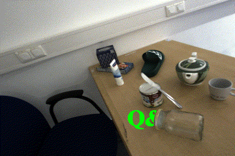

## Name
2D depth value demonstration

## Description
The example scene used for the demo here is the Scene12_traj2_2 from HAMMER Dataset

## Visuals

## Installation
Libraries "PIL.Image" and "cv2" need to installed to your environment additionally to the built-in Python methods used 

## Usage
Basically getting the required images (depth_gt, depth_prediction, rgb_img and object_mask) in the data folder for an another scene is sufficient. Afterwards the paths are defined at the start of the main script.

It is important to have the depth images in "uint8" format!

By running the main script you should be able to get a new gif with the predefined one directional trajectory. Some additional adjustments might be needed to get a reasonable gif. See the TODO's in the code.

## Support
For questions refer to "ge64jaq@tum.de"

## Contributing
Introducing transparency by adding alpha values(RGB-A image) would be possible.

## Authors and acknowledgment
Thanks to Patrick Ruhkamp, Witold Pacholarz, Kagan Kücükaytekin, Tobias Preinter and Volkan Tatlikazan.

	w
